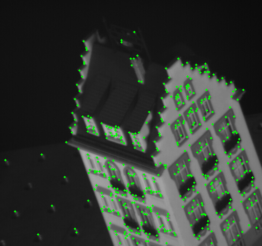
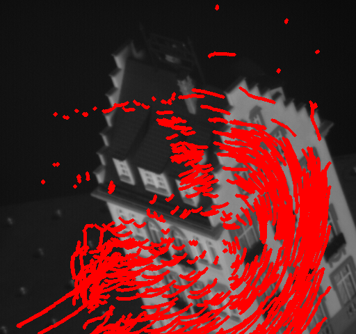

# feature-detection-tracking
### This python notebook deals with feature detection of keypoints and tracking them across 50 images

* The first part of the project is to implement **Harris Corner Detection** from **scratch** on the first image of the sequence.  
* The next part of the project is to track the points detected previously over 50 images using **Lucas Kanade Optical Flow** Algorithm implemented from **scratch**.

### 1. Feature detection 

Feature Points             |  
:-------------------------:|
  |  

### 2. Lucas Kanade Algoirthm
Tracked Points            | 
:-------------------------:|
 |